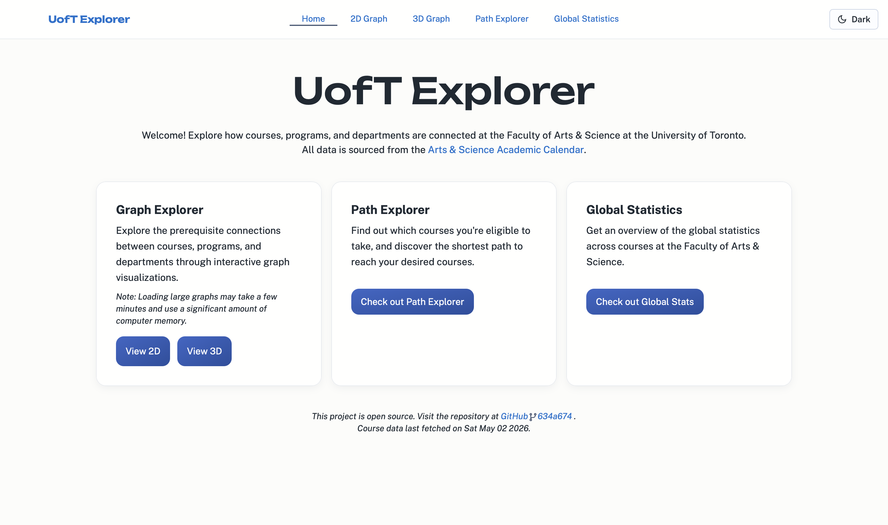
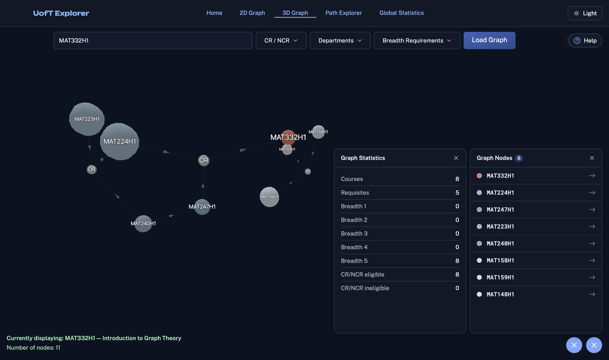
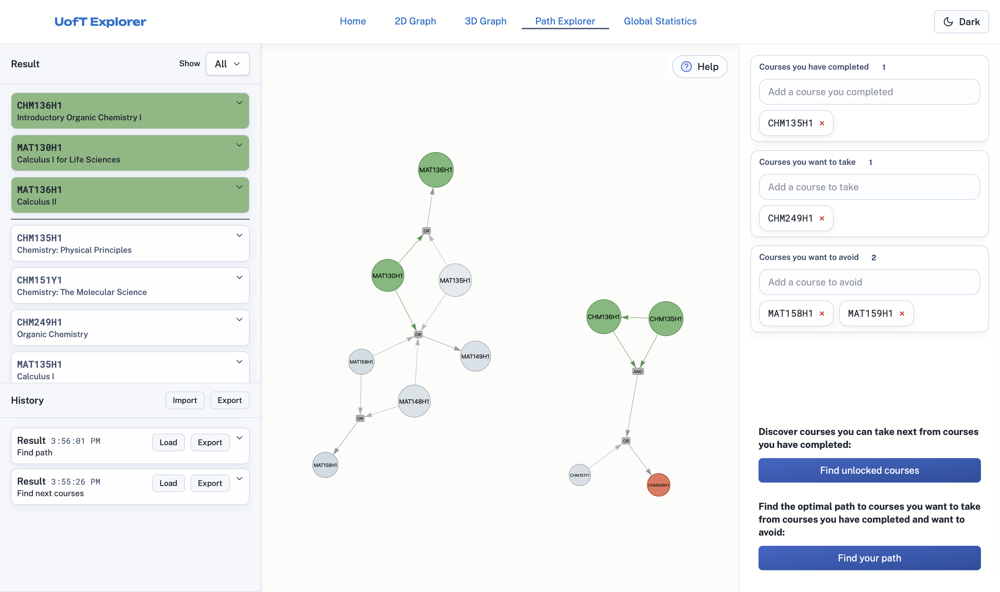

# UofT Explorer

A graph visualizer tool for courses and their requisites at the University of Toronto.
Currently a work in progress for further improvements and deployment.

## Demo

  
  
  

## Features

- **Graph Querying**: Generate graph visualizations of courses by searching for courses and programs, and filtering by CR/NCR, breadth requirements, and department.
- **2D and 3D Graph Visualizations**: Explore colour-coded graph visualizations of courses and their relationships in 2D and 3D.
- **Path Explorer Tool — Find Eligible Courses**: Discover what courses you become eligible to take based on the courses you have already completed.
- **Path Explorer Tool — Course Planning Recommendations**: Find the optimal course combination to take in order to become eligible for a desired course.
- **Live Graph Statistics**: View statistics about the graphs you generate.
- **Global Statistics**: A report on computed statistics across the Faculty of Arts & Science at UofT.

## Related Projects

- [Courseography](https://courseography.cdf.toronto.edu/graph)
- [UofT Index](https://uoftindex.ca/home)
- [Enrollment Tracker](https://icprplshelp.github.io/UofT-Enrollment-Tracker/)

## Project Structure

## Contributors

## Development Setup & Contributing

See [SETUP.md](./SETUP.md) and [CONTRIBUTING.md](./CONTRIBUTING.md) for local development setup and contribution guidelines.
