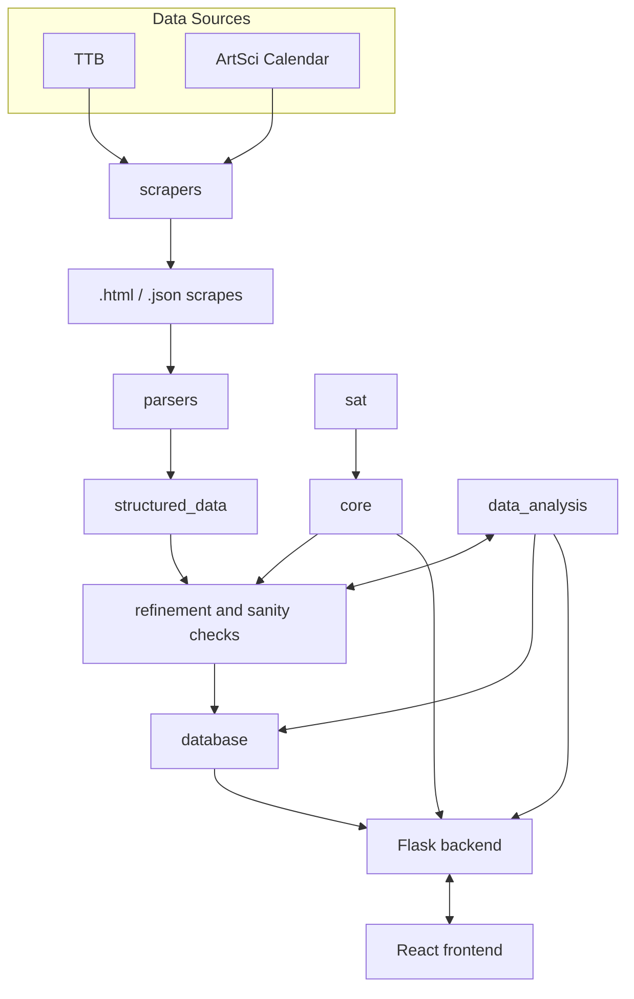

# UofT Explorer

A graph visualizer tool for courses and their requisites at the University of Toronto.

Originally completed as a project for [CSC111 — Foundations of Computer Science II](https://artsci.calendar.utoronto.ca/course/csc111h1) and currently a work in progress for further improvements and deployment.

## Features

## Related Projects

- [Courseography](https://courseography.cdf.toronto.edu/graph)
- [UofT Index](https://uoftindex.ca/home)
- [Enrollment Tracker](https://icprplshelp.github.io/UofT-Enrollment-Tracker/)

## Project Structure

## Contributors

